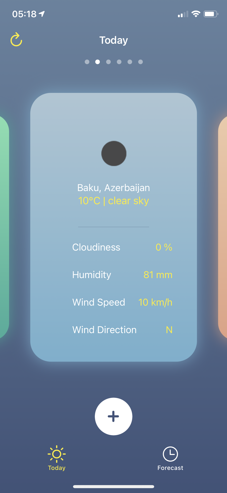
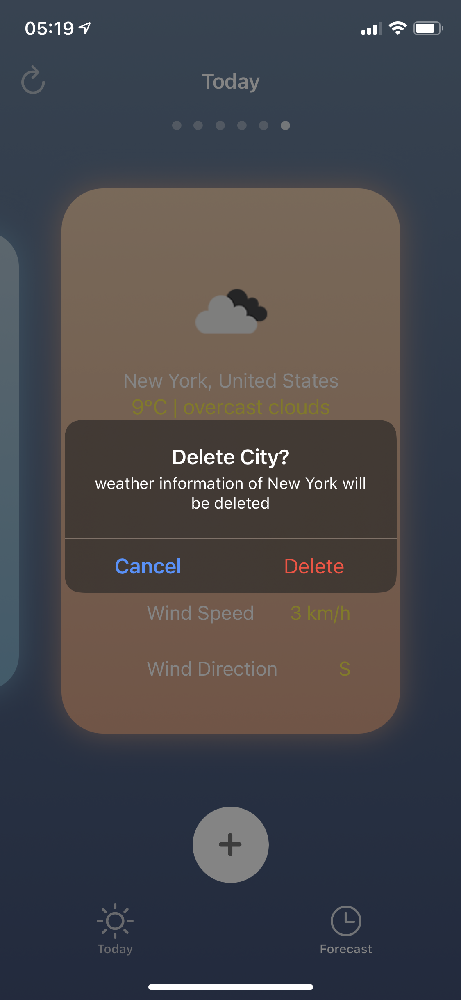
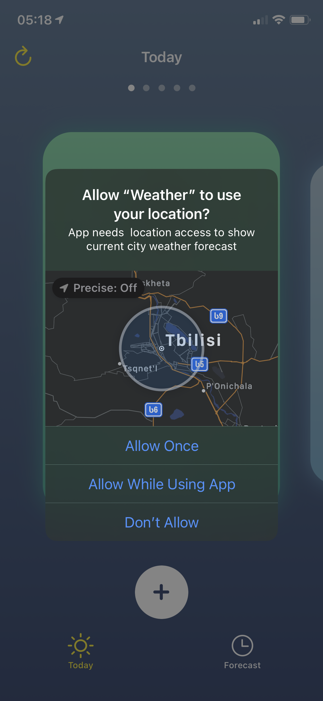
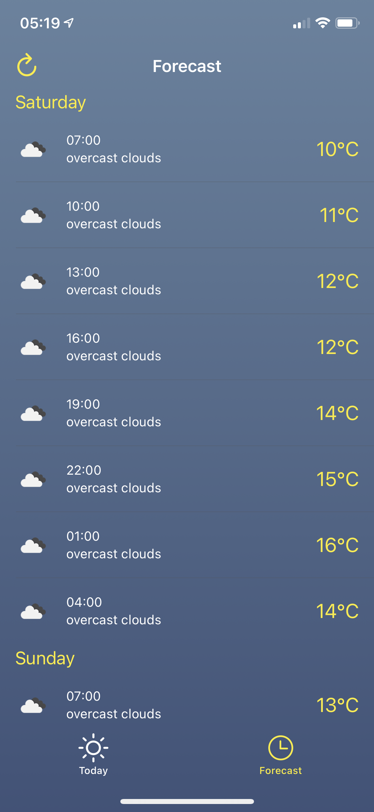
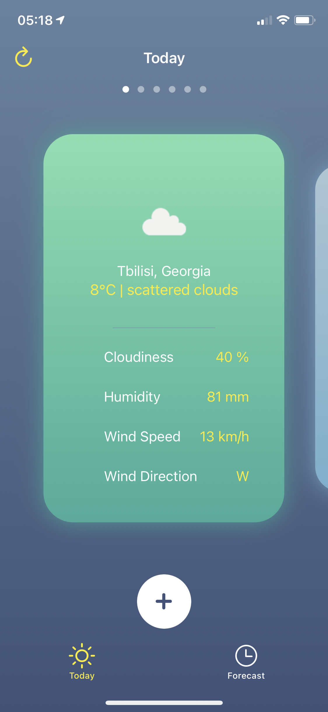

# Weather
Weather app for iOS using <a href="https://openweathermap.org">openWeatherMap<a/> API. Project features use of location services, API request handling, concurrency, custom and responsive layouts.  

### Result:

  
  
   
  

  
   
  

  
